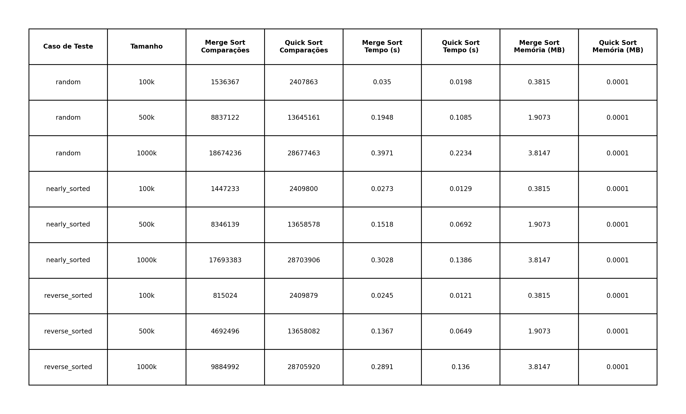
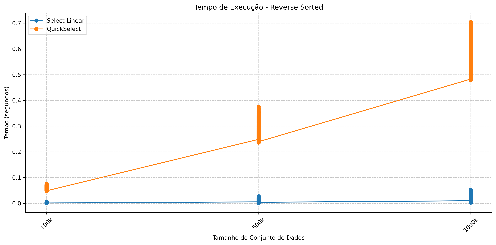

# Relatório de Análise de Algoritmos de Ordenação e Seleção

Vamos apresentar uma análise comparativa do desempenho de diferentes algoritmos de ordenação e seleção, com base em benchmarks de tempo de execução, número de comparações e uso de memória. Os testes foram realizados em três cenários distintos: dados aleatórios, dados quase ordenados e dados em ordem inversa. Foram executadas 100.000 vezes para cada cenário, totalizando 1.800.000 de execuções dos algoritmos em quase 7 dias de processamento síncrono. Os valores médios foram calculados a partir da média de todas as execuções de cada cenário.

## Análise de Algoritmos de Ordenação

Nesta seção, analisamos os algoritmos: Merge Sort e Quick Sort.

A tabela abaixo resume os tempos de execução, número de comparações e uso de memória para cada algoritmo nos diferentes cenários e tamanhos de entrada (n).

### Tempo de Execução

Os gráficos a seguir detalham o comportamento do tempo de execução à medida que `n` aumenta para cada cenário.

| Cenário Aleatório | Cenário Quase Ordenado | Cenário Ordem Inversa |
| :---: | :---: | :---: |
|  |  |  |

- O **Quick Sort** apresenta o melhor desempenho nos cenários trabalhados. No entanto, seu desempenho pode degradar para O(n²) em casos de pivôs ruins, como pode ocorrer em dados já ordenados ou em ordem inversa (dependendo da estratégia de pivoteamento). Como foi escolhido o pivô aleatório, temos ainda bons resultados nos 3 cenários comparativos.
- O **Merge Sort** exibe um tempo de execução muito consistente em todos os cenários, mantendo sua complexidade O(n log n) independentemente da organização inicial dos dados, porém ocorrendo uma maior dispersão de resultados em comparação com o Quick Sort, principalmente em ordem inversa.

### Número de Comparações

O número de comparações é uma métrica importante para entender a eficiência de um algoritmo de ordenação.

| Cenário Aleatório | Cenário Quase Ordenado | Cenário Ordem Inversa |
| :---: | :---: | :---: |
|  |  |  |

- O número de comparações segue a mesma tendência do tempo de execução, refletindo a complexidade teórica dos algoritmos. O Quick Sort realizou mais comparações e com mais dispersão dos dados a medida em que `n` aumenta, especialmente no cenário quase ordenado. O Merge Sort, por sua vez, teve um comportamento muito mais consistente em todos os cenários, refletindo sua complexidade O(n log n).

### Consumo de Memória

A análise do consumo de memória é crucial para aplicações com restrições de recursos.

| Cenário Aleatório | Cenário Quase Ordenado | Cenário Ordem Inversa |
| :---: | :---: | :---: |
|  |  |  |

- O **Merge Sort**, em sua implementação padrão, requer espaço auxiliar de O(n) para armazenar as metades do array durante a fusão. Isso é visível nos gráficos, que mostram um aumento linear no consumo de memória.
- O **Quick Sort**, sendo um algoritmo in-place, utiliza espaço auxiliar de O(log n) na pilha de recursão. Seu consumo de memória é significativamente menor em comparação com o Merge Sort, tornando-o uma escolha preferível quando a memória é uma restrição.

---

## Análise de Algoritmos de Seleção

Nesta seção, analisamos os algoritmos: Quickselect e Select Linear (Mediana das Medianas).

A tabela abaixo resume os tempos de execução, número de comparações e uso de memória para cada algoritmo nos diferentes cenários e tamanhos de entrada (n).

### Tempo de Execução

Os gráficos a seguir detalham o comportamento do tempo de execução para cada cenário.

| Cenário Aleatório | Cenário Quase Ordenado | Cenário Ordem Inversa |
| :---: | :---: | :---: |
|  |  |  |

### Número de Comparações

Os gráficos a seguir detalham o comportamento do número de comparações para cada cenário.

| Cenário Aleatório | Cenário Quase Ordenado | Cenário Ordem Inversa |
| :---: | :---: | :---: |
|  |  |  |

### Consumo de Memória

Os gráficos a seguir detalham o comportamento do consumo de memória para cada cenário.

| Cenário Aleatório | Cenário Quase Ordenado | Cenário Ordem Inversa |
| :---: | :---: | :---: |
|  |  |  |

### Estabilidade e Garantias (Quickselect vs. Select Linear)

- **Quickselect:** Este algoritmo tem um desempenho excelente no caso médio, com complexidade O(n). Isso o torna extremamente rápido na prática para dados aleatórios. No entanto, sua grande desvantagem é a instabilidade no pior caso. Se a escolha do pivô for consistentemente ruim (por exemplo, sempre o menor ou o maior elemento), o desempenho degrada para O(n²). Os gráficos, especialmente no cenário de ordem inversa, mostram picos ou um comportamento quadrático se a implementação do pivô for simples.
- **Select Linear (Mediana das Medianas):** A principal vantagem deste algoritmo é sua garantia de tempo de execução linear no pior caso (O(n)). Ele alcança isso através da garantia que a partição seja sempre "boa o suficiente". Embora sua constante de complexidade seja maior que a do Quickselect no caso médio (tornando-o mais lento em média), ele ofereceu um comportamento superior nos cenários trabalhados.

Pelos gráficos, observa-se que o Select Linear é geralmente mais rápido, tendo o Quick Select como a escolha menos adequada.

---

## Conclusão

A escolha do algoritmo ideal depende fortemente dos requisitos da aplicação e das características dos dados de entrada.

- Para **ordenação**, o **Quick Sort** é uma excelente escolha para o caso médio, com melhor desempenho em memória e tempo de execução, mas o **Merge Sort** é preferível se menos comparações forem necessárias. 
- Para **seleção**, o **Select Linear** é preferível nos cenários trabalhados, em todos os aspectos de tempo de execução, número de comparações e consumo de memória. 
